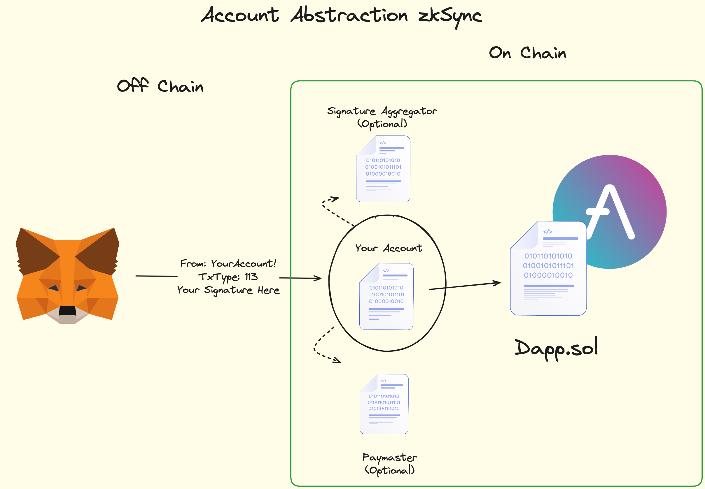

Everything is in README.md

**Account Abstraction in Ethereum**
  

**Account Abstraction in ZkSync**
  

# Account Abstraction
Account Abstraction (AA) fundamentally redefines user accounts in Web3. Instead of traditional Externally Owned Accounts (EOAs) controlled solely by a private key, AA allows user accounts to be smart contracts. This paradigm shift enables programmable validity conditions – dictating who can send transactions and under what circumstances – and custom execution logic, offering unprecedented flexibility and security. These smart contract-based accounts are often referred to as "smart contract wallets."

## The Bottleneck: Why Traditional Crypto Wallets Hinder Adoption

The traditional approach to managing crypto assets has long been a significant barrier to widespread adoption. Consider the typical user journey:

1. A user receives a 12-word seed phrase.

2. This seed phrase generates a private key.

3. This private key is the sole authenticator for signing all transactions.

This model, while secure in theory, presents several critical pain points for the average user:

* **Complexity**: Managing seed phrases and private keys is a daunting task. Users are expected to become security experts overnight, safeguarding these cryptic strings of characters.

* **High Stakes**: The loss of a seed phrase or private key typically means irreversible loss of access to all associated funds. There are no "forgot password" options.

* **Security Risks**: If a private key or seed phrase is accidentally leaked or compromised, malicious actors can gain unfettered access to and drain the user's wallet.

* **Gas Fee Friction**: Every on-chain action, no matter how small, requires the user to hold and spend the blockchain's native token (e.g., ETH on Ethereum) for gas fees. This "gas problem" is a constant hurdle, especially for new users who might not have any native tokens to begin with.

* **Limited Wallet Privacy**: All transactions originating from a single private key are linked, potentially revealing a user's activity patterns.

* **Batching Inefficiencies**: Performing multiple operations often requires deploying an intermediary smart contract, adding complexity and cost.

These issues collectively create a poor user experience, making it difficult to onboard new users to the world of decentralized finance and Web3.

## What is Account Abstraction? The Core Shift in Transaction Validation

Account Abstraction fundamentally redefines how transactions are authorized and validated on a blockchain. The core idea is to move away from a rigid system where transaction validity is solely tied to an Elliptic Curve Digital Signature Algorithm (ECDSA) signature generated by a private key. Instead, AA allows for **arbitrary validation logic** defined within a smart contract.

To put it simply:

* **Traditional Model**: Private Key = Wallet. The private key is the ultimate authority.

* **Account Abstraction Model**: Programmable Logic = Wallet. The authority and validation rules are defined by the code within a smart contract account.

This shift means that instead of the blockchain protocol itself dictating that only a private key signature can authorize a transaction from an Externally Owned Account (EOA), the account itself (now a smart contract) dictates the conditions under which a transaction is considered valid.

This programmable validity opens up a wealth of possibilities:

* **Social Login/Recovery**: Users could authorize transactions using familiar credentials like a Google account, GitHub, or even biometrics, abstracting away the need to directly manage private keys.

* **Multi-signature (Multi-sig) Wallets**: Require approvals from multiple parties (e.g., three out of five authorized signers) before a transaction is executed.

* **Spending Limits**: Enforce daily, weekly, or per-transaction spending caps directly at the account level.

* **Time Locks**: Permit transactions only during specific windows (e.g., business hours) or after a certain delay.

* **Parental Controls**: A wallet for a minor could be configured such that transactions initiated by the child require approval from a parent's account before execution.

## Gas Abstraction: Solving the "Need Gas" Problem with Paymasters
A significant corollary of programmable validation is **gas abstraction**. Because the account's validation logic is flexible, AA enables mechanisms where someone other than the user can pay for their transaction gas fees.

This directly addresses the friction point where users need native tokens for every interaction. With AA, a dApp developer, a project, or a dedicated third-party service (known as a "Paymaster") can sponsor transactions. The user can interact with a dApp without needing to first acquire and hold ETH (or the L2's native token) specifically for gas.

## How Account Abstraction Works: EIP-4337 vs. Native Implementations
The implementation of Account Abstraction varies, leading to different levels of complexity. There are two primary approaches:

1. **Ethereum (EIP-4337)**: This standard implements Account Abstraction on top of the existing Ethereum protocol without requiring core consensus changes. It relies on a higher-level infrastructure, including a special smart contract (`EntryPoint.sol`) and an alternative mempool for user operations. EIP-4337 went live on Ethereum mainnet on March 1st, 2023.

2. **Native Account Abstraction (e.g., zkSync)**: Some Layer 2 solutions and newer blockchains build Account Abstraction directly into their core protocol. This often leads to a more streamlined and integrated experience.

### Traditional Ethereum Transaction Flow (Recap)
Before diving into EIP-4337, let's quickly recap the traditional Ethereum transaction flow:

1. **Off-Chain**: A user, using a wallet like MetaMask, signs transaction data with their private key. This signature, along with the transaction details and gas payment, is prepared.

2. **On-Chain**: The signed transaction is broadcast to an Ethereum node.

3. The node validates the transaction (including the signature and sufficient gas) and, if valid, adds it to its local mempool.

4. Miners/validators pick transactions from the mempool to include in a new block, which is then added to the blockchain.

## Account Abstraction on Ethereum via EIP-4337: A Detailed Look
EIP-4337 introduces a new, parallel system for transaction processing that leverages smart contracts to achieve account abstraction. The flow involves several key components:

1. **Deploy a Smart Contract Wallet (SCW)**:
Instead of relying solely on an EOA, the user interacts through a **Smart Contract Wallet (SCW)**. This SCW is a smart contract deployed on the blockchain (e.g., `MyNewAccount.sol`) that contains the custom validation logic. This logic dictates what constitutes a valid authorization for that specific account – it could be a signature from a specific key (mimicking an EOA), a multi-sig condition, or a check against an off-chain authentication service.

2. **Construct and Send a "UserOperation" (UserOp) to the Alt Mempool**:
When a user wants to perform an action (e.g., send tokens, interact with a DeFi protocol), their wallet interface (now AA-aware) constructs a **UserOperation** (`UserOp`) object. This is not a standard Ethereum transaction. The `UserOp` struct, defined in the EIP-4337 specification, includes fields such as:

* `sender`: The address of the user's SCW.

* `nonce`: A sequence number to prevent replay attacks.

* `callData`: The actual operation to be executed by the SCW (e.g., the function call and parameters for an ERC20 transfer).

* Gas-related fields (`callGasLimit`, `verificationGasLimit`, `preVerificationGas`, `maxFeePerGas`, `maxPriorityFeePerGas`).

* `paymasterAndData`: Optional data for specifying a Paymaster to sponsor gas fees.

* `signature`: The signature that satisfies the SCW's custom validation logic.

This `UserOp`, signed according to the SCW's rules, is then sent to a separate, off-chain peer-to-peer network known as the **Alternative Mempool (Alt Mempool)**. This mempool is specifically for `UserOps` and operates independently of Ethereum's main transaction mempool.

3. **Bundlers Process UserOps**:
Specialized nodes participating in the Alt Mempool network are called **Bundlers**. Their role is to:

* Listen for `UserOps` in the Alt Mempool.

* Validate each `UserOp` by simulating its validation logic against the target SCW.

* Bundle multiple valid `UserOps` together into a single, standard Ethereum transaction.

* Crucially, the **Bundler pays the gas fee** for this bundled Ethereum transaction sent to the main Ethereum network. They are later compensated either by the SCWs themselves or by Paymasters.

4. **Bundler Calls the `EntryPoint.sol` Contract**:
The Bundler submits this bundled transaction by calling a specific function (typically `handleOps`) on a single, globally deployed smart contract called `EntryPoint.sol`. This contract (developed and maintained by the `eth-infinitism` group, with support from the Ethereum Foundation) acts as the central orchestrator for EIP-4337. Its canonical address (e.g., `0x5FF137D4b0FDCD49DcA30c7CF57E578a026d2789` for v0.6/v0.7) is known and trusted.

The `EntryPoint.sol` contract then performs its own set of critical operations:

* It iterates through each `UserOp` in the bundle.

* For each `UserOp`, it first verifies the `UserOp`'s signature and other parameters by calling a validation function on the user's SCW (e.g., `validateUserOp`).

* It checks if the SCW has enough funds to pay the Bundler for gas, or if a specified Paymaster has agreed to cover the costs.

5. **Smart Contract Wallet Executes the Transaction**:
If the validation step in `EntryPoint.sol` (which involves calling the SCW's validation logic) is successful, `EntryPoint.sol` then calls another function on the user's SCW to execute the actual intended operation. This is where the `callData` from the `UserOp` is executed (e.g., making a swap on Uniswap, or lending assets on Aave).

* Importantly, during this execution phase, the `msg.sender` for the target dApp interaction will be the address of the user's SCW, not the Bundler or the `EntryPoint` contract. This ensures that from the perspective of other smart contracts, the SCW is the true originator of the action.
The results of these operations are then recorded on the Ethereum blockchain.

6. **Optional EIP-4337 Add-ons**:

* **Signature Aggregators**: EIP-4337 supports the use of Signature Aggregator contracts. These contracts can be used by `EntryPoint.sol` to validate aggregated signatures (e.g., BLS signatures). This is particularly useful for multi-sig SCWs or for batching operations, as it can significantly reduce gas costs by verifying multiple signatures in a single operation.

* **Paymasters**: As mentioned, a Paymaster is a smart contract that can agree to pay the gas fees for a `UserOp`. The `UserOp` can specify a Paymaster contract and include data that the Paymaster requires for its validation (e.g., a signature from the dApp sponsoring the transaction). If a Paymaster is used and successfully validates, it reimburses the Bundler via the `EntryPoint.sol` contract. If no Paymaster is used, the user's SCW must have sufficient native token balance, which `EntryPoint.sol` will transfer to the Bundler as compensation.

The EIP-4337 flow, while powerful, involves several interconnected components: the user's SCW, the UserOp object, the Alt Mempool, Bundlers, and the central `EntryPoint.sol` contract.

## Native Account Abstraction: The zkSync Example
Blockchains with native Account Abstraction, such as zkSync Era, integrate AA principles directly into their core protocol, often resulting in a simpler architecture for developers and users.

In zkSync Era:

* The roles of the Alt Mempool and Bundlers are effectively handled by the regular chain nodes/sequencers.

* **Every account is fundamentally a smart contract**. Even when a user creates an account using a familiar tool like MetaMask (which traditionally generates an EOA), zkSync automatically deploys a default smart contract account implementation for that address.

* This default account contract (e.g., `DefaultAccount.sol` in the `matter-labs/era-contracts` repository) implements standard interfaces like `IAccount` and includes functions such as `validateTransaction`, `executeTransaction`, and `isValidSignature`. By default, this contract mimics traditional EOA behavior, validating transactions based on an ECDSA signature from the associated private key.

* However, users or developers can **override** this default implementation by deploying custom smart contract code to their account address. This custom code can then define any arbitrary validation logic, effectively turning any account into a fully programmable smart contract wallet.

The simplified flow on a native AA chain like zkSync might look like this:

1. **Off-Chain**: A signer (which could be a traditional private key, a social login mechanism, or a multi-sig scheme) signs the transaction data according to the account's logic.

2. **On-Chain**: The signed transaction is sent to zkSync nodes. These nodes natively understand AA and can directly call the validation logic within the user's account contract.

3. If valid, the transaction is executed by the user's account contract, and the results are included in a block on the zkSync blockchain.

This native approach bypasses the need for a separate Alt Mempool and the `EntryPoint.sol` contract, as the core protocol itself is designed to handle programmable account validity.

## The Future is Abstracted: Enhanced Usability for Web3
Account Abstraction, whether through EIP-4337 on Ethereum or via native implementations on Layer 2s and other blockchains, represents a monumental step towards improving blockchain usability. While the EIP-4337 mechanism on Ethereum involves a complex interplay of off-chain and on-chain components, its goal is to make interacting with Web3 applications as seamless and intuitive as using Web2 applications.

By abstracting away the complexities of private key management and gas payments, AA paves the way for features like social recovery, sponsored transactions, spending limits, and much more. Ultimately, this will lower the barrier to entry, making decentralized technologies more accessible to a broader audience and helping to onboard the next wave of users into the crypto ecosystem.

---

## Ethereum's Approach to Account Abstraction: ERC-4337
The Ethereum ecosystem primarily tackles Account Abstraction through the ERC-4337 standard. This standard introduces a decentralized infrastructure layer without requiring consensus-level protocol changes.

**Key Components of ERC-4337**:

* `EntryPoint.sol`: This is a globally recognized, trusted smart contract. It acts as the central coordinator for AA transactions. Bundlers submit `UserOperations` to this contract, which then orchestrates their validation and execution against the target smart contract wallet.

* `UserOperation`: Instead of standard Ethereum transactions, users (or dApps on their behalf) create `UserOperation` objects. These objects detail the intended action, signature, gas parameters, and other necessary data for the smart contract wallet.

* `Alt-Mempool`: `UserOperations` are not broadcast to the standard Ethereum transaction mempool. Instead, they are sent to a separate, alternative mempool (often called an "alt-mempool").

* **Bundlers**: These are specialized actors who monitor the alt-mempool. They select `UserOperations`, bundle them into a single standard Ethereum transaction, and submit this bundle to the `EntryPoint.sol` contract. Bundlers pay the gas for this Layer 1 transaction and are subsequently reimbursed, typically from the smart contract wallet or a Paymaster.

**Minimal Ethereum AA Implementation: `MinimalAccount.sol`**

The `MinimalAccount.sol` contract, found within the `src/ethereum/` directory, serves as a foundational example of an ERC-4337 compatible smart contract wallet. Its primary design goal is simplicity, offering a clear starting point for developers.

   * **Core Functionality**:

       * It permits transaction initiation by either its "owner" (the EOA that deployed it) or the `EntryPoint.sol` contract.

       * The `validateUserOp` function is crucial for verifying an incoming `UserOperation` from the `EntryPoint`. It typically checks signatures and other conditions.

       * The `execute` function is called by the `EntryPoint` after successful validation to perform the actual transaction logic (e.g., calling another contract).

   * **Extensibility**: While minimal, `MinimalAccount.sol` is designed for extension. Developers can incorporate:

       * **Paymaster Logic**: To allow third parties (Paymasters) to sponsor transaction fees.

       * **Custom Signature Schemes**: Integrating alternative signature validation, potentially via a Signature Aggregator.

       * **Spending Allowances/Limits**: Enforcing rules on transaction values or frequencies.

       * **Session Keys**: Implementing temporary, permission-restricted keys (e.g., using Google session keys) for specific interactions.

**Ethereum AA Transaction Flow (ERC-4337)**:

1. **UserOperation Creation**: A user, often interacting through a dApp, signs data that forms a `UserOperation`.

2. **Submission to Alt-Mempool**: The `UserOperation` is sent to an alt-mempool.

3. **Bundler Action**: Bundlers retrieve `UserOperations` from the alt-mempool, package them into a standard Ethereum transaction, and submit this bundle to the `EntryPoint.sol` contract on-chain.

4. **Validation**: The `EntryPoint.sol` contract calls the `validateUserOp` function on the target smart contract wallet (e.g., an instance of `MinimalAccount.sol`). This function verifies the operation's legitimacy (e.g., signature, nonce).

5. **Execution**: If `validateUserOp` succeeds, the `EntryPoint.sol` contract then calls the `execute` function on the smart contract wallet, which carries out the intended action (e.g., an ERC20 token transfer or a smart contract interaction).

6. **Optional Paymaster Involvement**: A Paymaster contract can be specified in the `UserOperation` to cover the gas fees, enabling gasless experiences for the end-user.

## zkSync's Native Account Abstraction: A Built-in Solution
zkSync approaches Account Abstraction differently by integrating it directly into its Layer 2 protocol. This native implementation offers a more streamlined experience and distinct characteristics compared to Ethereum's ERC-4337.

**Key Differences and Features in zkSync Native AA**:

* **No Alt-Mempool**: AA transactions on zkSync are submitted to the regular zkSync mempool, just like EOA transactions. There's no need for a separate mempool infrastructure.

* **Type 113 Transactions**: AA transactions are designated as `Type 113` (hexadecimal `0x71`). This specific type signals to the zkSync protocol that the transaction originates from a smart contract account and requires special handling.

* **Bootloader**: A critical system-level component in zkSync, the Bootloader plays a central role in processing AA transactions. During both the validation and execution phases of an AA transaction, the `msg.sender` to the smart contract wallet will be the Bootloader's address.

* **Smart Contract as `from` Address**: A significant distinction is that in zkSync, the `from` field of a `Type 113` transaction can be the address of the smart contract wallet itself. This contrasts with Ethereum, where the `from` field is always an EOA.

**Minimal zkSync AA Implementation: `ZkMinimalAccount.sol`**

The `ZkMinimalAccount.sol` contract, located in `src/zksync/` of the repository, demonstrates a basic smart contract wallet utilizing zkSync's native AA.

* **Important Contract Functions**:

   * `validateTransaction(bytes32 _txHash, bytes32 _suggestedSignedHash, Transaction _transaction)`: This function is paramount. It's called by the Bootloader to validate the incoming transaction. Responsibilities include verifying signatures against `_suggestedSignedHash` (which is `keccak256(abi.encodePacked(txHash, EIP1271_SUCCESS_RETURN_VALUE))`) and, crucially, incrementing the account's nonce to prevent replay attacks.

   * `executeTransaction(bytes32 _txHash, bytes32 _suggestedSignedHash, Transaction _transaction)`: After successful validation, the Bootloader calls this function to execute the actual logic defined in the `_transaction` payload.

   * `payForTransaction(...)`: This function (or logic within `validateTransaction`) handles the payment of transaction fees, ensuring the account can cover the costs or that a Paymaster will.

**zkSync Native AA Transaction Flow**:

The lifecycle of a `Type 113` transaction on zkSync involves two main phases, orchestrated by the zkSync system and the Bootloader:

* **Phase 1: Validation**

   1. **Submission**: The user (or dApp) sends the `Type 113` transaction to a zkSync API client. The `from` field of this transaction is the address of the `ZkMinimalAccount.sol` instance.

   2. `msg.sender` **is Bootloader**: For both validation and execution phases, the `msg.sender` to the `ZkMinimalAccount.sol` will be the Bootloader.

   3. **Nonce Check (System)**: The API client, interacting with the NonceHolder system contract, verifies the uniqueness of the transaction's nonce for the account.

   4. **Account Validation Call**: The API client (via the Bootloader) calls `validateTransaction` on the `ZkMinimalAccount.sol`. This function must perform signature checks and update the account's nonce.

   5. **Nonce Update Verification (System)**: The API client checks if the `ZkMinimalAccount.sol` correctly updated its nonce.

   6. **Fee Payment Check (System)**: The API client calls `payForTransaction` on the account (or invokes Paymaster logic if specified) to ensure the transaction fees can be covered.

   7. **Bootloader Payment Verification (System)**: The API client confirms that the Bootloader will be compensated for processing the transaction.

* **Phase 2: Execution**

   1. **To Sequencer**: The validated transaction is passed from the API client to the main zkSync node/sequencer.

   2. **Account Execution Call**: The main node (via the Bootloader) calls `executeTransaction` on the `ZkMinimalAccount.sol`, which then performs the intended operations.

   3. **Post-Transaction (Optional)**: If a Paymaster was involved, its `postTransaction` method might be called.

## Comparing Implementations: Ethereum (ERC-4337) vs. zkSync Native AA
Understanding the practical differences is key when observing on-chain activity.

* **zkSync Sepolia Example (Native AA)**:

   * Consider a transaction approving USDC spending from a deployed `ZkMinimalAccount` (e.g., `0xCB38...5691`).

   * On the zkSync Sepolia explorer, the `from` address of this transaction (hash `0x4322...d0fd`) will be the `ZkMinimalAccount` smart contract address itself. This directly demonstrates the smart contract initiating the call.

* **Ethereum (Arbitrum Example with ERC-4337)**:

   * Consider a similar USDC approval from a `MinimalAccount` deployed on Arbitrum (an Ethereum L2 that can support ERC-4337).

   * On Arbiscan, the transaction (hash `0x03f9...154b`) will show its `from` **address** as a **Bundler** (e.g., `0x9EA9...F6fC`).

   * The transaction's `to` **address** will be the `EntryPoint.sol` contract (e.g., version 0.7.0 at `0x000...032`).

   * However, by inspecting the transaction logs, one would find an `Approval` event emitted by the USDC contract where the `owner` (the account granting approval) is the MinimalAccount smart contract wallet address (e.g., `0x83Ad...AAf`). This confirms that, despite the Bundler being the transaction submitter, the smart contract wallet was the effective initiator of the state change via the EntryPoint.


## Core Components: Paymasters and Signature Aggregators
Both ERC-4337 and zkSync's native AA can be enhanced with optional components:

  * **Paymasters**: These are smart contracts that can sponsor transaction fees on behalf of users. This enables "gasless" transactions for the end-user, where the dApp, a protocol, or another entity covers the costs. Paymasters are integrated into the validation flow, agreeing to pay if certain conditions are met.

  * **Signature Aggregators**: In scenarios involving multiple `UserOperations` (especially in ERC-4337) or complex multi-signature schemes within a single account, Signature Aggregators can validate multiple signatures in a batch. This can lead to significant gas savings by reducing the on-chain verification overhead.

## Code Overview and Extensibility

* `src/ethereum/MinimalAccount.sol`: For ERC-4337 compatible chains.

* `src/zksync/ZkMinimalAccount.sol`: For zkSync and its native AA.

These minimal contracts are designed as starting points. The true power of Account Abstraction is unlocked by extending their validation logic (`validateUserOp` on Ethereum, `validateTransaction` on zkSync). Developers can build upon these bases to incorporate:

* **Advanced Paymaster integrations**.

* **Novel signature schemes** (e.g., BLS signatures, quantum-resistant signatures).

* **Granular spending allowances** or time-based spending limits.

* **Session keys** for enhanced dApp interactions, allowing temporary, restricted access without exposing primary owner keys. For example, a game might be granted a session key that can only sign transactions related to in-game actions for a limited duration.

## Unlocking Advanced Use Cases with Account Abstraction
The customizability offered by these minimal AA frameworks paves the way for sophisticated wallet features:

* **Session Keys**: Granting temporary, limited permissions to dApps or other services for specific actions (e.g., a gaming session key that can only sign game-related transactions for a set period).

* **Custom Multisig**: Implementing complex N-of-M signature schemes beyond standard multisigs, potentially involving role-based access or conditional approvals (e.g., requiring 2 out of 3 specific signers plus a time-locked passcode).

* **Social Recovery**: Enabling users to regain access to their accounts through a set of trusted guardians or social connections, rather than relying solely on a seed phrase.

* **Gas Sponsorship**: Facilitating frictionless onboarding and interaction by allowing dApps or protocols to cover transaction fees for their users via Paymasters.

### Key Takeaways for Developers
Building and experimenting with both the Ethereum ERC-4337 style and zkSync's native Account Abstraction implementations provides invaluable insight into their respective nuances, strengths, and trade-offs. The core innovation lies in the programmable validation logic within the smart contract wallet itself (`validateUserOp` or `validateTransaction`). This programmability is what empowers developers to create highly secure, user-friendly, and feature-rich Web3 experiences, moving beyond the limitations of traditional EOA wallets. By understanding these foundational patterns, developers can choose the most suitable AA approach for their target blockchain and application needs.

## Understanding the ERC-4337 Interaction Flow
To correctly implement `MinimalAccount.sol`, we must understand the ERC-4337 standard. This Ethereum Improvement Proposal (EIP) outlines the architecture for account abstraction without requiring consensus-layer changes. You can find the full specification at eips.ethereum.org/EIPS/eip-4337.

The ERC-4337 flow can be visualized as follows:

1. **Off-Chain User Action**: A user signs data, which forms a `UserOperation`. This `UserOperation` is essentially a pseudo-transaction that describes the action the user wants their smart contract wallet to perform.

2. **Alternative Mempool (Bundlers)**: The signed `UserOperation` is sent to specialized nodes called Bundlers. Bundlers are actors in the ERC-4337 ecosystem that listen for `UserOperations` on an alternative, off-chain mempool. They validate these operations (checking for correctness, potential profitability, etc.).

3. **On-Chain Execution via EntryPoint**: Bundlers package valid `UserOperations` into a standard Ethereum transaction and send it to a globally deployed singleton contract called the `EntryPoint.sol`.

4. **EntryPoint Contract Logic**: The `EntryPoint` contract is the central orchestrator. It first verifies the `UserOperation`. This verification step involves calling a specific function on the user's smart contract wallet (`MinimalAccount.sol`). If verification succeeds, the `EntryPoint` then executes the UserOperation, again by calling a function on the user's smart contract wallet. The `EntryPoint` also handles interactions with Paymasters (contracts that can sponsor gas fees) and Signature Aggregators (for more efficient signature schemes).

5. **Smart Contract Wallet (Account)**: `MinimalAccount.sol` is the user's smart contract wallet. The `EntryPoint` interacts directly with this contract for both validating the `UserOperation` (e.g., checking the signature) and executing the intended action (e.g., calling another contract).

6. **Blockchain Inclusion**: The entire interaction, initiated by the Bundler's transaction to the `EntryPoint`, is ultimately included in a block on the Ethereum blockchain.

The `UserOperation` struct, defined by ERC-4337, is crucial. It bundles all necessary data for an off-chain pseudo-transaction, including fields like `sender` (the smart contract wallet's address), `nonce`, `callData` (the action to execute), various gas limits, `paymasterAndData`, and the `signature`. This is the data structure passed around in the alt-mempool.

When the `EntryPoint` contract interacts with an account contract on-chain, it uses a packed version of this `UserOperation`.

---

## Advance Debugging in Foundry

Foundry has integrated debugger. If you have a specific test function failing, such as testEntryPointCanExecuteCommands, you can invoke the debugger with increased verbosity using the following command:

```bash
forge test --debug testEntryPointCanExecuteCommands -vvv
```
*(Initially, you might run forge test --mt testEntryPointCanExecuteCommands -vvv to match the test name, and then add the --debug flag to dive deeper.)*

Executing this command launches a low-level debugger interface. This interface provides a wealth of information, including EVM opcodes, the current call stack, memory contents, and, importantly, the corresponding Solidity source code context when available.

### Tip 1: Instantly Navigate to the Revert Location
When a transaction reverts, your first goal is to find out where it reverted. Foundry's debugger offers a handy shortcut for this:

* **Keyboard Shortcut**: `Shift + G`

Pressing `Shift + G` instructs the debugger to jump directly to the EVM instruction that caused the revert. If source mapping is available, it will also highlight the corresponding line in your Solidity code.

### Tip 2: Understanding the Pre-Revert State by Stepping Backwards
Knowing where the revert happened is useful, but to understand *why*, we often need to inspect the state and execution path leading up to it. The debugger allows us to step backward through the execution trace.

* **Keyboard Shortcut**: `J` (repeatedly press to step to the previous EVM opcode)

   * The on-screen help often shows `[k/j]: prev/next op`, where `k` steps forward (next opcode) and `j` steps backward (previous opcode).

Sometimes you might encounter messages like "No source map for contract ......." This means the debugger doesn't have the source code mapping for that specific part of the dependency. However, by continuing to step back, you will eventually land on a relevant Solidity line within the contract itself, if its source is available in your project or in your project dependency(in `lib/`).

---

## Transitioning to zkSync Account Abstraction
While EIP-4337 provides a robust framework for Account Abstraction on Ethereum, its reliance on an alt-mempool, external Bundlers, and the EntryPoint contract introduces a degree of complexity to the overall architecture.

**zkSync's Native Approach**

zkSync, as a Layer 2 scaling solution, has taken a different path by building Account Abstraction **natively into its protocol level**. This fundamentally changes and simplifies how AA is handled.

* **Key Distinction**: On zkSync, there is no requirement for a separate alt-mempool or external Bundler entities in the same way EIP-4337 mandates them for Ethereum. The zkSync sequencer and its underlying protocol are inherently designed to manage AA transactions.

* **Transaction Type 113**: To interact with a Smart Account on zkSync, users (or their wallets) send a special transaction of `Type 113`. This type signals to the zkSync network that the transaction originates from or targets a Smart Account and requires AA logic to be processed.

* **Combined Mempool**: zkSync effectively features a "combined mempool." The distinction between a standard mempool and an AA-specific alt-mempool dissolves. The native protocol understands how to route and process Type 113 transactions alongside regular transactions.

**The zkSync AA Flow**

1. A user (e.g., via a wallet like MetaMask configured for zkSync) initiates and sends a Type 113 transaction directly to the zkSync network.

2. This transaction specifies the `from` address as the Smart Account address.

3. The zkSync protocol itself, upon receiving this Type 113 transaction, directly handles calling the appropriate validation logic defined within the target Smart Account.

4. If the Smart Account's validation logic confirms the transaction's validity, the transaction is then executed.

5. Paymaster functionality is also natively supported within zkSync's AA model, allowing for sponsored transactions.

This native integration aims to provide a more streamlined and potentially more efficient AA experience compared to the layered approach of EIP-4337 on Ethereum L1.

**Important Resources**

* **EIP-4337**: The official Ethereum Improvement Proposal for Account Abstraction using an alternative mempool.

* **zkSync Documentation**: Particularly the sections on the "Bootloader," which is responsible for processing transactions (including Type 113 AA transactions) in batches. (Refer to `docs.zksync.io/zk-stack/components/zksync-evm/bootloader`).

---

## Deploying an ERC-4337 Smart Account and Sending a UserOperation on Arbitrum mainnet

1. **Deploying the MinimalAccount to Arbitrum Mainnet**

```bash
forge script script/DeployMinimal.s.sol --rpc-url $ARBITRUM_RPC_URL --account smallmoney --broadcast --verify
```
2. **Preparing and Sending a UserOperation via `MinimalAccount`**
With our `MinimalAccount` deployed, the next step is to send a `UserOperation` through it. This UserOp will instruct our smart account to interact with another contract on Arbitrum. We'll use another Foundry script, `SendPackedUserOp.s.sol`, for this purpose.

The core logic resides within the `run()` function of this script, which we need to populate.    

**Coding the `run()` function in `SendPackedUserOp.s.sol`:**

a. **Initialize** `HelperConfig`: This utility contract helps manage network-specific configurations.

```bash
HelperConfig helperConfig = new HelperConfig();
```

b. **Define Target Contract Address (`dest`)**: This is the address of the contract our UserOp will ultimately call. For this example, we'll target the Arbitrum mainnet USDC contract.

```solidity
address dest = 0xaf88d065e77c8cC2239327C5EDb3A432268e5831; // Arbitrum Mainnet USDC
```

c. **Define Call Value (`value`)**: Since our interaction (an `approve` call) doesn't involve sending ETH, this is `0`.

```solidity
uint256 value = 0;
```

d. **Define** `functionData`: This is the calldata for the internal call our `MinimalAccount` will make. We'll call the `approve` function on the USDC contract.
   * First, import `IERC20` if not already present
   * Then, encode the approve call:
   ```solidity
   bytes memory functionData = abi.encodeWithSelector(
    IERC20.approve.selector,
    0x9EA9b0cc1919def1A3CfAEF4F7A66eE3c36F86fC, // Spender address (another EOA)
    1e18 // Amount to approve (Note: USDC has 6 decimals, so 1e18 is a very large USDC amount)
   );
   ```
   *(The large approval amount is for demonstration; in a real scenario, use appropriate values and consider USDC's decimal precision.)*


e. **Define** `executeCallData`: This is the calldata for the `MinimalAccount`'s `execute` function. This function, when called by the EntryPoint, will perform the internal `approve` call defined above.

   * Import `MinimalAccount` if not already present
   * Encode the `execute` call:
   ```solidity
   bytes memory executeCallData = abi.encodeWithSelector(
    MinimalAccount.execute.selector,
    dest,
    value,
    functionData
   );
   ```

f. **Generate Signed UserOperation (`userOp`)**: We'll use a helper function, `generateSignedUserOperation` (assumed to be defined elsewhere in the script or an imported library), which handles creating the `PackedUserOperation` struct, fetching the nonce, calculating the UserOp hash, and signing it with the appropriate key.

```solidity
// The MinimalAccount address deployed earlier
address minimalAccountAddress = address(0x03Ad95a54f02A40180D45D76789C448024145aaF);
PackedUserOperation memory userOp = generateSignedUserOperation(
    executeCallData,
    helperConfig.getConfig(), // Contains network config like EntryPoint address
    minimalAccountAddress
);
```

g. **Prepare UserOp Array (`ops`)**: The EntryPoint's `handleOps` function expects an array of UserOperations.

```solidity
PackedUserOperation[] memory ops = new PackedUserOperation[](1);
ops[0] = userOp;
```

h. **Broadcast Transaction to EntryPoint**: Using Foundry's cheatcodes, we simulate broadcasting the transaction. The `handleOps` function is called on the ERC-4337 EntryPoint contract

```solidity
vm.startBroadcast();
// The beneficiary address receives gas refunds
address payable beneficiary = payable(helperConfig.getConfig().account); // Typically the burner account
IEntryPoint(helperConfig.getConfig().entryPoint).handleOps(ops, beneficiary);
vm.stopBroadcast();
```

**Important Setup**:
Before running this script, some configuration is necessary:

* `HelperConfig.s.sol` **Update**: This file must be updated with Arbitrum-specific configurations, such as the official EntryPoint contract address and the "account" address (your burner/smallmoney account used for broadcasting and as beneficiary).

* **Wallet/Private Keys**: Ensure your Foundry environment is correctly configured with the private keys, especially for the "smallmoney" account that will sign and broadcast the transaction to the EntryPoint.

**A Note on Testing Account Abstraction**:
Testing ERC-4337 account abstraction can be challenging. Ideally, one would use dedicated testnets fully supporting the ERC-4337 infrastructure (Bundlers, EntryPoint, Paymasters). In the absence of readily available, fully-fledged ERC-4337 testnets at the time of demonstration, deploying and testing directly on a mainnet like Arbitrum (using a burner account and minimal funds) was chosen, despite the inherent costs and risks.

**Executing the UserOperation Script**:
With the script prepared and configurations in place, we can run the command to send the UserOperation.

```bash
forge script script/SendPackedUserOp.s.sol --rpc-url $ARBITRUM_RPC_URL --account smallmoney --broadcast -vvv
```
3. **Verifying the UserOperation on Arbiscan**
After the script execution (or by looking up the pre-executed transaction), we can verify the outcome on Arbiscan. Navigate to the transaction hash generated by the `handleOps` call.

**Transaction Details on Arbiscan:**

* **Status**: Should be "Success".

* **Timestamp**: Will reflect when the transaction was mined.

* **From**: The address of your "smallmoney" burner account (the EOA that submitted the UserOp to the EntryPoint).

* **To (Interacted With)**: The ERC-4337 EntryPoint contract address on Arbitrum.

* **Input Data**: Decoded, this will show the call to the `handleOps` function. You'll see the `ops` array containing your `PackedUserOperation` (including the `sender` as your `MinimalAccount` address, `nonce`, the `callData` which is `executeCallData`, `signature`, etc.) and the `beneficiary` address.

**Internal Transactions and Event Logs**:
The crucial part is to inspect the event logs generated by this transaction:

1.**`Approval` Event (from USDC Token Contract)**: You should see an `Approval` event emitted by the USDC Token contract (`0xaf88...`). This confirms that the internal call within your UserOperation successfully executed the approve function on the USDC contract. The log details will show:

   * `owner`: The address of your `MinimalAccount`.

   * `spender`: The address you specified in `functionData`.

   * `value`: The amount approved (Arbiscan might display this based on 6 decimals for USDC, e.g., `1000000` if `1e6` was the effective amount after decimal conversion, or a larger number if `1e18` was directly interpreted, though USDC uses 6 decimals). The key is that an approval occurred.

2. `UserOperationEvent` (**from EntryPoint Contract**): The EntryPoint contract itself will emit a `UserOperationEvent`. This event signals the successful processing of your UserOp and includes vital information:

   * `userOpHash`: The unique hash of your UserOperation.

   * `sender`: The address of your `MinimalAccount`.

   * `paymaster`: Address of the paymaster if one was used (likely `address(0)` if not).

   * `nonce`: The nonce used for this UserOp from your `MinimalAccount`.

   * `success`: A boolean indicating if the UserOp execution was successful (should be `true`).

   * `actualGasCost`: The actual gas cost paid for the UserOp.

   * `actualGasUsed`: The gas used by the UserOp execution.

Seeing these events, particularly the `Approval` from USDC and a successful `UserOperationEvent`, confirms that your UserOperation was correctly processed by the EntryPoint. The EntryPoint, in turn, called the `execute` function on your `MinimalAccount`, which then successfully performed the intended internal transaction (the USDC approval).

---

## Account Abstraction: ZK Sync's Native Edge vs. Ethereum's EIP-4337
Account Abstraction (AA) fundamentally changes how accounts operate on a blockchain, allowing smart contracts to act as first-class accounts. However, ZK Sync and Ethereum (with EIP-4337) approach AA differently.

In **ZK Sync**, account abstraction is a **native, first-class feature**. This means the underlying protocol is designed to understand and handle abstracted accounts directly. There's no need for a separate layer of smart contracts to simulate AA functionality. Consequently, ZK Sync doesn't distinguish between "user operations" (a term from EIP-4337) and regular transactions at a fundamental level. To the ZK Sync system, all are simply "transactions."

In contrast, **Ethereum's EIP-4337** implements account abstraction through an overlay system. It relies on a series of smart contracts, such as an `EntryPoint` contract and smart contract wallets, built on top of the existing Externally Owned Account (EOA) model. While powerful, this is an application-layer solution rather than a protocol-native one.

This native integration in ZK Sync simplifies the architecture and offers a more streamlined experience for developers and users interacting with smart contract accounts.

### The Anatomy of a Transaction in ZK Sync: The Transaction Struct
At the heart of ZK Sync's transaction processing is a comprehensive `Transaction` struct. This struct is designed to represent all types of transactions within the system. Refering to a definition of this struct found in `lib/foundry-era-contracts/src/system-contracts/contracts/libraries/MemoryTransactionHelper.sol`. This is a helper file based on ZK Sync's actual transaction structure, created to simplify working with transactions in memory during development and tutorials.

Let's break down the key fields within the ZK Sync `Transaction` struct:

* `uint256 txType;`: Defines the type of the transaction. Examples include legacy Ethereum transactions, EIP-2930, EIP-1559, and ZK Sync's specific EIP-712 signed transaction (type `0x71` or `113`), which is particularly relevant for account abstraction.

* `uint256 from;`: The address initiating the transaction.

* `uint256 to;`: The destination address (callee) of the transaction.

* `uint256 gasLimit;`: The maximum amount of gas the transaction is allowed to consume.

* `uint256 gasPerPubdataByteLimit;`: A ZK Sync specific field, setting the limit for gas cost per byte of public data.

* `uint256 maxFeePerGas;`: The maximum fee per gas the sender is willing to pay (similar to EIP-1559).

* `uint256 maxPriorityFeePerGas;`: The maximum priority fee per gas (tip) the sender is willing to pay to the validator (similar to EIP-1559).

* `uint256 paymaster;`: The address of the paymaster contract. If this address is 0, no paymaster is used, and the from account pays the fees. Paymasters, which can sponsor transactions by covering fees, are a native feature in ZK Sync.

* `uint256 nonce;`: The transaction nonce, ensuring sequential processing and preventing replay attacks.

* `uint256 value;`: The amount of ETH (or native currency) being sent with the transaction.

* `uint256[4] reserved;`: An array reserved for future protocol extensions, ensuring forward compatibility.

* `bytes data;`: The calldata for the transaction, containing the function signature and arguments for a contract call, or arbitrary data.

* `bytes signature;`: The cryptographic signature authenticating the transaction. For smart contract accounts, this signature's validation logic is defined by the account itself.

* `bytes32[] factoryDeps;`: An array of bytecode hashes for contracts that need to be deployed along with this transaction. This is crucial for deploying smart contract wallets or any other contracts that the current transaction depends on but are not yet on-chain.

* `bytes paymasterInput;`: Data passed to the paymaster contract if one is specified in the `paymaster` field. This allows the paymaster to have custom logic based on the transaction.

* `bytes reservedDynamic;`: Reserved space for dynamic data, offering further flexibility for future protocol upgrades.

Understanding this `Transaction` struct is pivotal, as it's the primary data structure passed to the IAccount functions.

## Understanding the `IAccount` Interface: Your ZK Sync Smart Wallet Blueprint
The `IAccount.sol` interface defines the standard contract that all smart contract accounts on ZK Sync must adhere to. By implementing this interface, a smart contract can act as a fully-fledged account, capable of initiating transactions, validating signatures, and managing its own execution logic. 

A noteworthy practical consideration during development, particularly for exploring(or learning) purposes, is the handling of the `Transaction` struct. The `IAccount` interface often specifies `Transaction calldata _transaction` for its function parameters. However, to simplify coding and avoid potential complexities with `calldata`-to-`memory` conversions in Solidity (which can sometimes lead to unexpected issues), implementations like `ZkMinimalAccount.sol` might change this to `Transaction memory _transaction`. This is a developer convenience for the implementation phase.

You'll also notice parameters like `_txHash`, `_suggestedSignedHash`, and `_possibleSignedHash` in the `IAccount` functions. These are primarily related to the Bootloader, a low-level system component in ZK Sync responsible for transaction processing. For an initial understanding and implementation of `IAccount`, these hash parameters are often ignored, with the focus placed squarely on the `_transaction` struct.

---

## The Role of System Contracts in zkSync
One of the most significant architectural distinctions between Ethereum and zkSync lies in zkSync's extensive utilization of **System Contracts**. These are pre-deployed smart contracts on the zkSync network that manage fundamental protocol-level functionalities. Unlike Ethereum, where many core operations are handled by the client software or hard-coded into the protocol, zkSync delegates these to on-chain smart contracts.

The `NonceHolder.sol` contract is a prime example. Its responsibility is to manage nonces for all accounts on zkSync, ensuring that each transaction from a specific sender has a unique nonce. This mechanism is vital for maintaining transaction order and preventing double-spending.
Other system contracts on zkSync handle tasks like managing account code storage (`AccountCodeStorage`), system-wide context (`SystemContext`), and, crucially, contract deployment. Understanding these system contracts is essential for developers building applications that deeply integrate with zkSync's capabilities. You can find a comprehensive list and descriptions of these contracts in the official zkSync Era documentation under "System Contracts."

### Contract Deployment: A Tale of Two Networks (Ethereum vs. zkSync)
The process of deploying smart contracts differs notably between Ethereum and zkSync, primarily due to zkSync's reliance on system contracts for core operations.

**Ethereum's Deployment Mechanism**:
On Ethereum, deploying a smart contract involves sending a transaction where the `to` field (recipient address) is left null or set to the zero address. The transaction's data payload contains the compiled bytecode of the contract. Ethereum nodes recognize this specific transaction format as a contract creation request and execute the deployment. This method is well-documented in Ethereum's developer resources.

**zkSync's Deployment Mechanism**:
zkSync takes a different path. Instead of the null-recipient pattern, contract deployment is facilitated by interacting with a dedicated system contract: the `ContractDeployer`. This contract resides at a well-known, predefined address on the zkSync network (for instance, `0x0000000000000000000000000000000000008006` on zkSync Era Mainnet, verifiable via the zkSync block explorer).

To deploy a contract on zkSync, you call specific functions on this `ContractDeployer` system contract. These functions include:

* `create`

* `create2`

* `createAccount`

* `create2Account`

* `forceDeployOnAddress`

And others, each serving slightly different deployment scenarios or offering varied control over the deployment process. For example, `createAccount` is specifically designed for deploying account abstraction-compatible smart contract accounts. Developers can inspect the `ContractDeployer.sol` source code and its available functions directly on the zkSync block explorer by navigating to its address and viewing the "Write Contract" tab.

This system contract-based approach centralizes and standardizes contract deployment logic within the zkSync protocol.

### Navigating zkSync Deployment with Developer Tools: The Foundry Case
The divergence in contract deployment mechanisms between Ethereum and zkSync has direct implications for developer tooling. Standard Ethereum development tools, often designed around Ethereum's deployment conventions, may require specific configurations or flags to operate correctly with zkSync.

Foundry, a popular smart contract development toolkit, provides a good example. The standard Foundry command for deploying a contract, `forge create`, is tailored for the Ethereum deployment model (sending bytecode to a null address). When targeting zkSync, this command, in its vanilla form, won't work as expected because zkSync requires interaction with the `ContractDeployer` system contract.

To accommodate zkSync's deployment flow, `foundry-zksync` (the zkSync-compatible version of Foundry) introduces specific flags. For instance, you might use a command like:

```bash
# Terminal command
forge create --zksync --legacy
```

The `--zksync` flag tells Foundry to prepare the transaction for the zkSync network. The `--legacy` flag, in this context, instructs `foundry-zksync` to use an older deployment method that specifically interacts with the `ContractDeployer` system contract's `create` function. This ensures that the deployment adheres to zkSync's native process rather than attempting an Ethereum-style deployment.

Without such flags or zkSync-aware configurations, developers might find that their usual deployment commands fail or behave unexpectedly on zkSync. This highlights the importance of understanding how system contracts influence tooling interactions.

---

## Unpacking the zkSync TxType 113 Account Abstraction Lifecycle
 This specific transaction type is exclusively designed for enabling account abstraction on the zkSync network. Understanding this flow is crucial for developers building and interacting with smart contract accounts on zkSync.

The entire lifecycle, from user initiation to final execution, is meticulously defined and can be broadly categorized into two primary phases: Validation and Execution. The `src/zksync/ZkMinimalAccount.sol` contract itself provides a concise summary.

### Phase 1: The Validation Gauntlet for TxType 113 Transactions
The validation phase is a critical series of checks performed by the zkSync network to ensure the transaction is legitimate and the account is prepared for execution before it reaches the sequencer.

1. **User Initiates Transaction to API Client**:
The journey begins when a user sends their TxType 113 transaction to a "zkSync API client." This client can be thought of as a light node, serving as the initial entry point into the zkSync network.

2. **Nonce Uniqueness Check via `NonceHolder`**:
The zkSync API client immediately verifies the uniqueness of the transaction's nonce. This is paramount for preventing replay attacks. The check involves querying the `NonceHolder` system contract.
The `NonceHolder.sol` contract (typically found at `lib/foundry-era-contracts/src/system-contracts/contracts/NonceHolder.sol`) is a foundational system contract responsible for managing nonces for all accounts, including smart contract accounts, on zkSync. It utilizes mappings to track the nonce for every contract. A key data structure within `NonceHolder.sol` is:

```solidity
// RawNonces for accounts are stored in format
// /// minNonce + 2^128 * deploymentNonce, where deploymentNonce
// /// is the nonce used for deploying smart contracts.
mapping(uint256 account => uint256 packedMinAndDeploymentNonce) internal rawNonces;
```
This mapping allows the API client to efficiently retrieve the current nonce for the sending account and ensure the submitted transaction's nonce is correct and has not been used before.

3. **Invoking `validateTransaction` on the Account Contract:**

Next, the zkSync API client calls the `validateTransaction` function directly on the user's smart contract account. This function is a cornerstone of zkSync's account abstraction model.
A crucial requirement is that this `validateTransaction` c**all MUST update the account's nonce**. This is a state-changing operation that signals the nonce has been consumed for this specific transaction validation.

```solidity
contract ZkMinimalAccount is IAccount {
    // ...
    function validateTransaction(
        bytes32 _txHash,
        bytes32 _suggestedSignedHash,
        Transaction memory _transaction
    ) external payable returns (bytes4 magic) {
        // ... logic to validate signature, permissions, and update nonce ...
    }
    // ...
}
```

If `validateTransaction` executes successfully (e.g., signature is valid, permissions are met, and nonce is updated) and returns the expected `bytes4 magic` value, zkSync nodes consider the transaction valid up to this point. Otherwise, it's rejected.

4. **The Bootloader as `msg.sender` during Validation**:
A critical question arises: who is the `msg.sender` when `validateTransaction` is invoked? Since it's a state-changing call (updating the nonce), the caller identity matters significantly for security and contract logic.
For a TxType 113 transaction, the `msg.sender` during the `validateTransaction` call (and other system-initiated calls within this AA flow) is always the **Bootloader system contract**.
The Bootloader is a "super admin" system contract, analogous to the EntryPoint contract (ERC-4337) on Ethereum mainnet. It plays a fundamental role in orchestrating zkSync's native account abstraction, acting as the trusted intermediary that calls into the account contract for validation and execution steps. You can find more details in the official zkSync documentation (e.g., `docs.zksync.io/zk-stack/components/zksync-evm/bootloader.html`).

5. **Confirmation of Nonce Update**:
After the `validateTransaction` call returns, the zkSync API client performs a secondary check to confirm that the account's nonce has indeed been incremented as expected. If the nonce wasn't updated by the `validateTransaction` implementation, the transaction will be reverted at this stage.

6. **Handling Transaction Payment**:
The API client then proceeds to handle the payment logic for the transaction. This can involve:

  * Directly calling `payForTransaction` on the account if the account pays for itself.

  * If a paymaster is utilized, the flow involves calls to `prepareForPaymaster` and subsequently `validateAndPayForPaymasterTransaction`. These functions allow a third-party (the paymaster) to sponsor the transaction fees.

7. **Verification of Bootloader Compensation**:
Finally, the zkSync API client verifies that the Bootloader contract has been adequately compensated for its role in processing the transaction. The Bootloader incurs costs for orchestrating these steps, and it needs to have a sufficient balance to cover them, similar to how an ERC-4337 EntryPoint contract might be pre-funded or reimbursed.

Once all these validation steps are successfully completed, Phase 1 concludes.

### Phase 2: Executing the Validated TxType 113 Transaction
With the transaction thoroughly validated, it moves to the execution phase, which is primarily handled by the main zkSync node or sequencer.

8. **Validated Transaction Relayed to Main Node/Sequencer**:
The zkSync API client (light node) forwards the now-validated transaction to the main zkSync node, which also currently serves as the sequencer. It's worth noting that efforts are ongoing within the zkSync ecosystem to decentralize the sequencer role.
This separation of concerns—validation by API clients and execution by the main node/sequencer—is a strategic design choice. It helps protect the main sequencer from potential Denial of Service (DoS) attacks by offloading the initial, potentially resource-intensive, validation checks.

9. **Invoking `executeTransaction` on the Account Contract**:
The main node (sequencer) takes the validated transaction and calls the `executeTransaction` function on the user's smart contract account.
The `executeTransaction` function in `ZkMinimalAccount.sol` typically has a signature like this:

```solidity
function executeTransaction(
    bytes32 _txHash,
    bytes32 _suggestedSignedHash,
    Transaction memory _transaction
) external payable {
    // ... logic for actual transaction execution (e.g., token transfer, contract call) ...
}
```
This function contains the actual logic the user intended to perform (e.g., transferring tokens, interacting with another DeFi protocol). This is analogous to the `execute` or `executeBatch` functions in an ERC-4337 `MinimalAccount.sol`.
For robust security, the `executeTransaction` function, when part of this native TxType 113 account abstraction flow, should be implemented to ensure it can **only be called by the Bootloader contract**. This prevents unauthorized external calls from bypassing the established validation and fee payment mechanisms.

10. **Post-Transaction Logic (Paymaster Involvement)**:
If a paymaster was used to sponsor the transaction fees, a `postTransaction` function is invoked. This function allows the paymaster to perform any necessary cleanup, reconciliation, or finalization logic after the main transaction execution is complete.

This sequence—from validation by the API client to execution by the sequencer via the Bootloader—constitutes the complete lifecycle for a standard TxType 113 account abstraction transaction on zkSync.

### Beyond the Standard Flow: `executeTransactionFromOutside`
The `ZkMinimalAccount.sol` contract, and similar account implementations, may also feature another function: `executeTransactionFromOutside`.

```solidity
function executeTransactionFromOutside(Transaction memory _transaction) external payable {
    // ... logic to process transactions initiated by any EOA or contract ...
}
```
This function is distinct from the `executeTransaction` function discussed earlier, which is specifically called by the Bootloader within the native account abstraction (TxType 113) flow.

`executeTransactionFromOutside` is designed to be callable by any external actor, such as an Externally Owned Account (EOA) or another smart contract interacting directly with the smart contract wallet. Even when a transaction is initiated through this external pathway, if the account intends for it to be processed with account abstraction features (like custom validation logic), the underlying mechanisms within the account contract would still need to engage its validation logic (e.g., checking signatures, permissions). The exact flow might differ from the strict TxType 113 protocol but would leverage the account's inherent capabilities.

## Key Pillars of zkSync's Native Account Abstraction
The TxType 113 lifecycle highlights several core components and concepts fundamental to zkSync's native account abstraction:

* **TxType 113 (0x71)**: This is zkSync's designated transaction type for enabling sophisticated account abstraction features natively at the protocol level.

* **System Contracts are Central**:

   * `NonceHolder`: A global system contract that meticulously manages nonces for all accounts, ensuring transaction order and preventing replays. Its role in the initial validation step is critical.

   * `Bootloader`: This powerful system contract is the orchestrator of the account abstraction flow. It acts as the `msg.sender` for crucial calls like `validateTransaction` and `executeTransaction` on the smart contract account. The Bootloader must also be compensated for the gas costs it incurs. Its function is comparable to the `EntryPoint` contract in Ethereum's ERC-4337 standard.

* **Mandatory Nonce Update in Validation**: A strict requirement of the `validateTransaction` function is that it must update the account's nonce. This is a key part of the stateful validation process.

* **`msg.sender` Context Awareness**: Understanding that the `Bootloader` is the `msg.sender` during system-initiated AA calls is vital for developers writing secure account contracts. Access controls within `validateTransaction` and `executeTransaction` often rely on verifying the caller is indeed the Bootloader.

* **Modular Account Interface (`IAccount`)**: Functions such as `validateTransaction`, `payForTransaction`, and `executeTransaction` represent distinct, modular steps defined by zkSync's `IAccount` interface, allowing for flexible and custom implementations by smart contract account developers.

* **Security Through Restricted Access**: Implementing robust security measures, such as restricting `executeTransaction` to be callable only by the Bootloader during the AA flow, is essential to maintain the integrity of the account abstraction system.

By understanding these phases, system contracts, and design principles, developers can effectively leverage the power of native account abstraction on zkSync to build next-generation smart contract wallets and applications.

---

## The Challenge and Solution: System Contract Calls & zkSync Simulations
Directly calling zkSync system contracts from other contracts can be complex and is often restricted for security reasons. zkSync addresses this with a mechanism called "simulations." These are specially crafted call patterns within your Solidity code that the zkSync compiler recognizes and transforms, but only when a specific compiler flag is active.

When this flag is enabled, the compiler converts these simulation calls into the actual, low-level system contract calls required to interact with contracts like NonceHolder. If the flag is disabled, the simulation call remains as written, likely failing or behaving unexpectedly. Simulations thus serve as a developer-friendly abstraction layer, enabling privileged system contract interactions that are resolved at compile time.

### Activating Simulations: The `--system-mode` Compiler Flag
To enable the zkSync compiler to process these simulations, you must use the `--system-mode=true` flag with your compilation command.

Crucial Correction: While some older documentation or contexts might mention an `is-system = true` setting in foundry.toml, for Foundry zkSync projects, this is incorrect. The correct method is to pass the flag directly in the command line:

```bash
forge build --zksync --system-mode=true
```
This flag instructs the zkSync compiler to recognize and transform simulation patterns into legitimate system calls.

### How zkSync Simulations Function: An Illustrative Example
The core idea behind simulations is a specific syntax that the compiler, in "system mode," interprets specially. Consider this conceptual example (inspired by discussions on platforms like Ethereum Stack Exchange):

```solidity
// Conceptual example of a simulation pattern
// This is NOT actual production code for NonceHolder
bool success = call(address(SYSTEM_CONTRACT_PLACEHOLDER), gasleft(), abi.encodeWithSelector(SOME_SELECTOR, some_argument)) == SystemContract.someFunction(expected_return_value);
```
* Without `--system-mode=true`: The compiler would treat this as a standard external call, comparing its boolean return value to the result of S`ystemContract.someFunction(expected_return_value)`.

* With `--system-mode=true`: The compiler recognizes this pattern. Instead of executing the `call` and the comparison, it replaces the entire line with the bytecode equivalent of making the intended system call, for example, `systemcontract.updateNonceHolder(1)` (if that were the target).

The `call(...) == SystemContract...` syntax is effectively syntactic sugar. It's a pattern developers write, which the compiler, when in system mode, translates into the appropriate low-level system interaction.

### Implementing Nonce Incrementation via Simulations
To implement the nonce increment, we'll leverage utilities provided by the `foundry-era-contracts` library, avoiding the need to write raw simulation patterns.

1. **Import** `SystemContractsCaller`: This library provides a helper function for making system calls.

```solidity
import {SystemContractsCaller} from "lib/foundry-era-contracts/src/system-contracts/contracts/libraries/SystemContractsCaller.sol";
```
2. **Import** `NONCE_HOLDER_SYSTEM_CONTRACT` **Address**: The address of the `NonceHolder` system contract is required. This is available in `Constants.sol`.

```solidity
import {NONCE_HOLDER_SYSTEM_CONTRACT} from "lib/foundry-era-contracts/src/system-contracts/contracts/Constants.sol";
```

Note: While these addresses are generally stable for mainnet, they can change with network upgrades. The values in `Constants.sol` typically reflect the current mainnet deployment.

3. **Import** `INonceHolder` **Interface**: To correctly ABI-encode the call data for our interaction with `NonceHolder`.

```solidity
import {INonceHolder} from "lib/foundry-era-contracts/src/system-contracts/contracts/interfaces/INonceHolder.sol";
```
4. **Implement the Call in** `validateTransaction`:
Within your `validateTransaction` function, after other checks but before returning the magic value, you will increment the nonce:

```solidity
// Inside validateTransaction, after owner and fund checks
// _transaction is the IAccount.Transaction struct passed to validateTransaction
​
// This is the simulation: it gets replaced by a system call at compile time
// when --system-mode=true is used.
SystemContractsCaller.systemCallWithPropagatedRevert(
    uint32(gasleft()), // gasLimit: Pass remaining gas for the system call
    address(NONCE_HOLDER_SYSTEM_CONTRACT), // to: The NonceHolder system contract address
    0, // value: No ETH value is sent for this particular system call
    abi.encodeCall(INonceHolder.incrementMinNonceIfEquals, (_transaction.nonce)) // data: Encoded call to NonceHolder.incrementMinNonceIfEquals with the expected current nonce
);
```

Let's break down the `systemCallWithPropagatedRevert` parameters:

* `uint32(gasleft())`: Specifies the gas limit for the system call, using the remaining gas.

* `address(NONCE_HOLDER_SYSTEM_CONTRACT)`: The target system contract address.

* `0`: The Ether value sent with the call (zero in this case).

* `abi.encodeCall(INonceHolder.incrementMinNonceIfEquals, (_transaction.nonce))`: This is crucial. It ABI-encodes the call to the `incrementMinNonceIfEquals` function of the `INonceHolder` interface, passing the transaction's expected current nonce (`_transaction.nonce`) as the argument. This encoded data forms the payload for the system call.

### Key Considerations in zkSync Era
When implementing `executeTransaction` or similar functions interacting with the zkSync protocol:

* **Type Safety:** Be vigilant about type conversions (e.g., `uint256` to `address`, `uint256` to `uint128` or `uint32`). Utilize safe casting utilities like those provided in `Utils.sol` to prevent overflows and ensure compatibility, especially when interacting with system contracts or specific EVM operations.

* **System Contract Interactions**: Always use the `SystemContractsCaller` library for making calls to zkSync system contracts. This ensures that calls are formatted correctly and that reverts are propagated as expected within the zkSync environment.

* **Low-Level Calls** (`call`, `staticcall`, `delegatecall`): Understand that these operations might behave differently or have specific recommendations for use in the zkSync zkEVM compared to the standard EVM. Using assembly for these calls, as shown, can provide more direct control and alignment with zkSync's intended patterns. Always consult the official zkSync documentation for the latest guidance on EVM instruction differences.

* **Error Handling**: Check the success status of all external calls (whether via assembly call or Solidity's high-level `.call()`) and revert appropriately on failure using custom errors for better diagnostics.

* **Access Control**: Secure critical functions like `executeTransaction` with robust access control mechanisms, typically using modifiers, to prevent unauthorized execution.

### Key Considerations for zkSync Transactions
When constructing zkSync Transaction structs, keep the following points in mind:

* **Transaction Types** (`txType`): For zkSync native Account Abstraction, the `txType` is **113** (hex `0x71`). zkSync supports other transaction types (e.g., Legacy, EIP-2930, EIP-1559), but 113 is specific to AA.

* **Address Casting** (`uint256(uint160(address))`): A critical detail is that the `from` and `to` fields in the zkSync `Transaction` struct are uint256, not the standard `address` type. The conversion `uint256(uint160(someAddress))` is the standard way to cast an `address` (which is 160 bits) to a `uint256`. This distinction arises from lower-level data representation, a topic often explored in depth in areas like EVM assembly or formal verification.

* **Nonce Handling** (`vm.getNonce`): In our Foundry test, we use the `vm.getNonce(address)` cheatcode to retrieve the nonce for the `minimalAccount`. It's important to recognize that this is a simplification provided by Foundry. In a live zkSync Era environment, nonces are managed by a dedicated `NonceHolder` system contract. For robust, off-Foundry applications, you would interact with this `NonceHolder` contract to get the correct nonce.

* **Pubdata** (`gasPerPubdataByteLimit`): This field accounts for the cost associated with publishing data from zkSync (L2) back to Ethereum (L1). This is a distinct cost factor in zkEVM rollups, reflecting the L1 data availability requirements.

* **Factory Dependencies** (`factoryDeps`): This field is crucial if your transaction intends to deploy new contracts through the smart contract account. It holds the bytecode hashes of these new contracts. If your transaction only calls existing contracts, this array can be empty.

* **Paymaster Fields** (`paymaster`, `paymasterInput`): These fields are used when implementing sponsored transactions via a paymaster. If you're not using a paymaster, `paymaster` should be the zero address, and `paymasterInput` can be empty.

* **Reserved Fields**: These are populated with default empty/zero values as they are designated for future protocol enhancements or features.

---

## Diagnosing and Understanding the "Stack Too Deep" Solidity Error
When developing and testing complex Solidity smart contracts, particularly those involving intricate structures common in areas like zkSync account abstraction, developers may encounter a frustrating compiler error: "stack too deep." This error signals that the Ethereum Virtual Machine (EVM) or its zkSync equivalent, eraVM, would exceed its stack limit with the generated bytecode.

This issue frequently arises from:

* **Complex function logic**: Functions with numerous operations, local variables, or parameters.

* **Large data structures**: Extensive structs or arrays being manipulated within functions.

* **Deeply nested calls**: Multiple internal function calls that add layers to the call stack.

* **Helper functions manipulating large structs**: Common in account abstraction, where transaction objects can be substantial.

An example of this error, encountered when attempting to test a zkSync account abstraction contract using Foundry with the command forge t`est --mt testZkOwnerCanExecuteCommands --zksync`, might look like this:

```solidity
Error: Compiler run failed:
Error: Compiler error (/solidity/libyul/backends/evm/AsmCodeGen.cpp:67):Stack too deep. Try compiling with `--via-ir` (cli) or the equivalent `viaIR: true` (standard JSON) while enabling the optimizer. Otherwise, try removing local variables. When compiling inline assembly: Variable value0 is 3 slot(s) too deep inside the stack. Stack too deep. Try compiling with `--via-ir` (cli) or the equivalent `viaIR: true` (standard JSON) while enabling the optimizer. Otherwise, try removing local variables.
```
Notably, the error message itself often suggests a potential solution: enabling the "via-IR" compilation pipeline.

Enabling Via-IR in Foundry for Robust Compilation
The "via-IR" (Intermediate Representation) compilation pipeline offers a more sophisticated approach to converting Solidity code into bytecode. Instead of a direct translation, Solidity is first compiled to Yul, an intermediate language that resembles assembly. This Yul code is then compiled to EVM or, in the context of zkSync, eraVM bytecode.

This two-step process allows the Solidity compiler to perform more advanced optimizations, which can often generate more efficient bytecode and circumvent "stack too deep" errors. The key benefits are:

* **Resolves "stack too deep" errors**: By optimizing stack usage, it allows complex contracts to compile successfully.

* **Potentially more optimized bytecode**: The IR stage can lead to better overall bytecode efficiency.

However, there's a trade-off: enabling via-IR can slightly increase compilation times and, consequently, the duration of test suites. This is a factor to consider, but often necessary for complex projects.

To enable via-IR globally for a Foundry project, you need to modify the foundry.toml configuration file. Add the line `via-ir = true` under the `[profile.default]` section (or any other profile you are using).

Here's an example of how the `foundry.toml` might look after the change:

```toml
[profile.default]
src = "src"
out = "out"
libs = ["lib"]
remappings = ['@openzeppelin/contracts=lib/openzeppelin-contracts/contracts']
is-system = true # Often pre-configured for zkSync projects
via-ir = true    # This is the added line to enable via-IR
```

Now if you run that test again it won't through that error.

### Advanced Considerations for Solidity Testing and zkSync AA
While enabling `via-IR` resolves the "stack too deep" error and allows basic tests to pass, keep these points in mind for comprehensive testing and development:

* **Performance Impact of Via-IR**: As mentioned, via-IR can increase compilation and test execution times. This is a trade-off for handling complexity. Monitor your CI/CD pipeline and local development experience.

* **Test Negative Cases**: Thorough testing includes verifying scenarios that should fail. For account abstraction, this means testing if a non-owner cannot execute commands, or if transactions with invalid signatures are rejected.

* **zkSync Specifics**: The `Transaction` struct, transaction types (like `113` for `EIP712_TX_TYPE`), gas parameters, and paymaster interactions are highly specific to zkSync's implementation of account abstraction. Always refer to the official zkSync documentation for the most accurate and up-to-date details. You can often find relevant links in Foundry's output, such as `https://v2-docs.zksync.io/dev/developer-guides/aa.html`.

* **Explore Richer AA Features**: The demonstrated test is a foundational check. Account abstraction offers many more powerful features like social recovery, batch transactions, and gas sponsorship via paymasters. Subsequent tests should explore these capabilities.

* **Yul and Assembly**: For deeper optimization or understanding of how `via-IR` works, familiarity with Yul and EVM assembly can be beneficial, though not strictly required for enabling the flag.

By understanding the causes of "stack too deep" errors and knowing how to leverage tools like Foundry's `via-IR` option, developers can more effectively build and test sophisticated smart contracts, especially in rapidly evolving ecosystems like zkSync.

---

## Deploying Your First AA Contract to zkSync Testnet
Deploy our Account Abstraction smart contract to the zkSync Sepolia testnet.

1. Navigate to your project's terminal.

2. Execute the deployment script using Yarn:

```bash
yarn deploy
```
This command, as configured in the `package.json` file, triggers `ts-node javascript-scripts/DeployZkMinimal.ts`.

3. Upon successful execution, the script will output the address of the deployed `ZkMinimalAccount` contract. For this demonstration, the contract was deployed to: `0x19a519025994A1F32188dE1F0E11014A791fB358`.

4. You can verify the deployment on the zkSync Era Block Explorer for Sepolia (`sepolia.explorer.zksync.io`) by searching for this address.

**Note on Contract Verification**: At the time of this writing, smart contracts that heavily interact with zkSync's system contracts (as AA contracts do) might present challenges for automated source code verification on block explorers. While the deployed bytecode is visible, full source code verification might not always be straightforward.

### Powering Your AA Contract: Funding for Gas Fees
For an Account Abstraction smart contract to initiate and pay for its own transactions, it requires a balance of the native network token (ETH on zkSync).

To enable our newly deployed AA contract to send transactions:

1. Open your MetaMask wallet (or any compatible wallet).

2. Ensure your wallet is connected to the zkSync Sepolia testnet.

3. Send a small amount of testnet ETH (e.g., `0.001 ETH`) to the deployed AA contract address (`0x19a519025994A1F32188dE1F0E11014A791fB358`). This provides the contract with the necessary funds to cover gas costs for its outgoing transactions.

### Initiating Transactions from Your AA Smart Contract
Now that our AA contract is deployed and funded, we can demonstrate its core capability: sending a transaction where the contract itself is the initiator.

1. Open the `javascript-scripts/SendAATx.ts` script in your editor.

2. Locate the `ZK_MINIMAL_ADDRESS` constant (around line 14) and update it with the address of your deployed AA contract:

```typescript
const ZK_MINIMAL_ADDRESS = "0x19a519025994A1F32188dE1F0E11014A791fB358";
```
3. Return to your terminal and execute the transaction sending script:
```bash
yarn sendTx
```
This command runs `ts-node javascript-scripts/SendAATx.ts`.

4. **Behind the Scenes**: This script typically performs the following:

* It constructs a "user operation," which includes the target contract address (`to`), transaction data (`data`), value (`value`), and other parameters for a transaction the AA contract should execute (e.g., an approve call on a mock USDC contract).

* The owner EOA associated with the AA contract signs the hash of this user operation.

* The script then submits this signed user operation to the zkSync network, targeting your AA contract's `executeTransactionFromOutside` (or a similar entry point) function.

* Inside your AA contract, the `_validateTransaction` function verifies the signature against the owner.

* If validation passes, `_executeTransaction` executes the intended operation (e.g., the `approve` call).

5. The script will output a transaction hash for the AA transaction sent to the network.

6. Refresh the page for your AA contract address on the zkSync Sepolia explorer. You should observe a new transaction.

* **Crucially, the "FROM" field for this new transaction will be the address of your AA smart contract (`0x19a5...B358`)**. This is the hallmark of Account Abstraction: the smart contract itself initiated and paid for this transaction.

* Inspecting the transaction details will reveal the underlying action, such as an `approve` function call to a target contract (e.g., a mock USDC contract at `0x5249fD99f1C1aE9B04C65427257Fc3B8cD976620`), approving a specified spender.

### Core Account Abstraction Principles Demonstrated
This exercise effectively showcases several foundational concepts of Account Abstraction:

* **Smart Contracts as First-Class Accounts**: AA allows smart contracts to possess capabilities traditionally reserved for Externally Owned Accounts (EOAs), such as initiating transactions and paying for gas.

* **Native AA on zkSync**: zkSync's architecture natively supports smart contracts acting as the effective `tx.origin` or `msg.sender` at the entry point of a transaction, which is fundamental to its AA implementation.

* **EIP-712 Signatures for User Operations**: Securely authorizing transactions to be executed by an AA contract relies on cryptographic signatures, often following the EIP-712 standard for structured data signing. The `encodeHash` function within zkSync's tooling is vital for generating the correct message digest.

* **Interaction with zkSync System Contracts**: AA contracts often interact with zkSync's system contracts for functionalities like nonce management (via `NONCE_HOLDER_SYSTEM_CONTRACT`) and deployment (via `DEPLOYER_SYSTEM_CONTRACT`).

* **AA Transaction Lifecycle**:

1. An EOA (the "owner" of the AA) signs the details of the desired operation (the user operation).

2. This signed user operation is submitted to the network, targeting the AA smart contract.

3. The AA contract's validation logic (e.g., `validateTransaction`) verifies the signature and other preconditions.

4. Upon successful validation, the AA contract's execution logic (e.g., `executeTransaction`) performs the intended operation.

### Key Considerations for zkSync AA Development
As you explore Account Abstraction on zkSync, keep these important points in mind:

* **Foundry vs. Hardhat for zkSync Scripting**: For deployment and complex interaction scripts on zkSync, Hardhat (with TypeScript/JavaScript) currently offers more mature and robust tooling compared to Foundry's native scripting features.

* **Contract Verification Challenges**: Smart contracts that interface deeply with zkSync's system contracts may encounter difficulties with automated source code verification on block explorers.

* **Funding AA Wallets**: Remember that AA smart contract wallets must be funded with the native network token (ETH on zkSync) to cover the gas costs of the transactions they initiate.

* **Security is Paramount - Magic Value Check**: Always rigorously check the return values of validation functions (like `_validateTransaction`'s magic value) before proceeding with state-changing operations. This prevents execution based on failed or bypassed validation.

* **EIP-712 Hashing Integrity**: Pay close attention to the hashing mechanism. Ensure the hash being signed by the user and the hash being recovered within the contract are identical and correctly follow the EIP-712 standard. zkSync's `encodeHash` utility is designed to assist with this.

---

# Summary

## Understanding Account Abstraction: A Comprehensive Guide
Account Abstraction (AA) is a transformative concept in the Web3 space, fundamentally altering how user accounts interact with blockchain networks. It moves beyond the traditional Externally Owned Account (EOA) model, where accounts are solely controlled by private keys, to a paradigm where accounts can be smart contracts themselves. This allows for programmable validity – defining custom logic for how transactions are authorized and executed, rather than being restricted to simple cryptographic signature checks. This lesson explores the intricacies of Account Abstraction, contrasting its implementation on standard EVM chains via ERC-4337 with native AA solutions like those found on zkSync.

## The Core Principles of Account Abstraction
At its heart, Account Abstraction aims to make smart contract wallets the primary way users interact with blockchains, offering the programmability of smart contracts with the user experience typically associated with EOAs. Instead of a transaction's validity hinging solely on a private key's signature (ECDSA), AA enables a smart contract wallet to define any condition for validation. This could range from requiring a signature from a Google session key, authorization from a group of individuals (multisig), or even, hypothetically, conditions based on external data like the weather.

The primary goals of Account Abstraction include:

* **Enhanced User Experience (UX)**: Simplifying onboarding with familiar login methods, abstracting gas payments so users don't always need native tokens, and enabling easier account recovery.

* **Improved Security**: Implementing advanced security features like multi-factor authentication, social recovery mechanisms, and spending limits directly at the account level.

* **Increased Flexibility**: Allowing for custom transaction processing logic, batching operations, and enabling more sophisticated interactions with dApps.

## Account Abstraction on EVM Chains: The ERC-4337 Standard
For Ethereum and other EVM-compatible chains, Account Abstraction is primarily achieved through the **ERC-4337 standard**. This standard introduces a way to implement AA without requiring core protocol changes, relying instead on a higher-level infrastructure.

**Mechanism and Workflow**:

ERC-4337 introduces a separate, off-chain mempool often referred to as an "alt-mempool." Users don't submit standard transactions directly to the network's primary mempool. Instead, they create and sign **UserOperations (UserOps)**. A UserOp is a pseudo-transaction object that specifies the user's intent.

The workflow is as follows:

1. **UserOp Creation & Signing**: The user, through their smart contract wallet's interface, creates a UserOp and signs it according to the wallet's custom validation logic.

2. **Submission to Alt-Mempool**: The signed UserOp is sent to the alt-mempool.

3. **Bundling by Bundlers**: Specialized actors called Bundlers monitor the alt-mempool. They select multiple UserOps and bundle them into a single standard Ethereum transaction. This transaction is then sent to a globally deployed smart contract called the EntryPoint.

4.** EntryPoint Processing**: The `EntryPoint.sol` contract receives the bundle of UserOps via its `handleOps` function. For each UserOp:

* It calls the target smart contract wallet's `validateUserOp` function. This function checks the UserOp's signature, nonce, and ensures the wallet can cover the gas fees (potentially interacting with a Paymaster).

* If `validateUserOp` succeeds, the EntryPoint then calls the smart contract wallet's execution function (e.g., `execute`) to perform the intended action(s).

**Key Components in ERC-4337**:

* **UserOperation**: A struct containing details like `sender` (the smart contract wallet), `nonce`, `initCode` (if deploying the wallet), callData, gas limits, and `signature`.

* **Alt-Mempool**: An off-chain system for UserOps awaiting processing.

* **Bundlers**: Off-chain actors responsible for packaging UserOps into transactions and submitting them to the EntryPoint contract. They are compensated for the gas they spend.

* **EntryPoint.sol**: A singleton smart contract that orchestrates the validation and execution of UserOps.

* **Smart Contract Wallets**: Contracts implementing the `IAccount` interface (defined by ERC-4337), containing `validateUserOp` and execution logic.

* **Paymasters (Optional)**: Smart contracts that can sponsor transaction fees for users, enabling gas abstraction.

* **Signature Aggregators (Optional)**: Contracts that can compress multiple signatures from different UserOps into a single, more efficient signature, saving gas.

**Transaction `from` Address**: A crucial distinction in the ERC-4337 model is that the from address of the on-chain transaction that includes the UserOp is the Bundler's EOA address, not the smart contract wallet itself. The smart contract wallet is the sender within the UserOp.

**Code Insights: `MinimalAccount.sol` (ERC-4337 Example)**

A typical ERC-4337 smart contract wallet, like a `MinimalAccount.sol` example, would implement the `IAccount` interface:

* `validateUserOp(PackedUserOperation calldata userOp, bytes32 userOpHash, uint256 missingAccountFunds)`: This is a required function called by the EntryPoint. It's responsible for:

  * Verifying the UserOp's signature using a helper like `_validateSignature`.

  * Checking the nonce to prevent replay attacks.

  * Ensuring the wallet has sufficient funds or a Paymaster is covering costs, and potentially pre-funding the EntryPoint using an internal function like `_payPrefund`.

* `_validateSignature(PackedUserOperation calldata userOp, bytes32 userOpHash)`: An internal helper function. In a minimal setup, this uses `ECDSA.recover` to check if the signature on the `userOpHash` recovers to the `owner()` address of the smart contract wallet. It returns a magic value (e.g., `SIG_VALIDATION_SUCCESS` or `SIG_VALIDATION_FAILED`) to the EntryPoint.

* `execute(address dest, uint256 value, bytes calldata func)`: This function is called by the EntryPoint after successful validation. It contains the logic to perform the actual state-changing operation, such as making a call to another contract (`dest.call{value: value}(func)`).

* `_payPrefund(...)`: An internal function used to transfer funds from the smart contract wallet to the EntryPoint (or Bundler via the EntryPoint) to cover gas costs for the UserOperation.

Testing and scripting for ERC-4337 often involves tools like Foundry, using Solidity scripts (e.g., `SendPackedUserOp.s.sol`) to construct UserOps and interact directly with the EntryPoint contract's `handleOps` function.

## Native Account Abstraction: The zkSync Approach
zkSync, a Layer 2 scaling solution, implements Account Abstraction natively at the protocol level. This offers a more streamlined and integrated AA experience compared to the ERC-4337 overlay on general-purpose EVM chains.

**Mechanism and Workflow**:

With native AA, there's no need for a user/developer-managed alt-mempool or a global EntryPoint contract in the same way as ERC-4337. The AA logic is embedded into the zkSync protocol itself.

The workflow for a transaction from a smart contract wallet on zkSync is:

1. **Transaction Creation & Signing**: The user signs a specific transaction type (e.g., Type 113 on zkSync Era) using their smart contract wallet's defined logic.

2. **Direct Submission to Network**: The signed transaction is sent directly to the zkSync network.

3. **Protocol-Level Validation**: The zkSync sequencer (or protocol) directly calls the `validateTransaction` function on the smart contract wallet specified as the `from` address. This function verifies the signature, nonce, and ensures fees can be paid.

4. **Execution**: If validation is successful, the protocol proceeds to the execution phase, calling the `executeTransaction` function on the smart contract wallet to perform the intended operations.

**Key Components in zkSync Native AA**:

* **Type 113 Transaction Format (zkSync Era)**: A specific transaction type designed for smart contract accounts.

* **Smart Contract Wallet**: Must implement zkSync's `IAccount` interface, which includes functions like `validateTransaction`, `executeTransaction`, and `payForTransaction`.

* **System Contracts**: Special, privileged contracts on zkSync that handle core protocol functionalities. Smart contract wallets interact with these for operations like nonce management (e.g., NonceHolder) or contract deployment (e.g., `ContractDeployer`).

**Transaction `from` Address**: A significant advantage of zkSync's native AA is that the `from` address of the transaction is the smart contract wallet itself. This makes smart contract wallets behave like first-class citizens, similar to EOAs from the chain's perspective, simplifying interactions and compatibility.

**Code Insights: `ZkMinimalAccount.sol` (zkSync Native AA Example)**

A smart contract wallet designed for zkSync's native AA, such as ZkMinimalAccount.sol, would implement zkSync's `IAccount` interface:

* `validateTransaction(bytes32 _txHash, bytes32 _suggestedSignedHash, Transaction calldata _transaction)`: This is a required function called by the zkSync protocol during the validation phase. It must:

  * Validate the transaction's signature against the `_txHash` or `_suggestedSignedHash` using the wallet's custom logic (e.g., `ECDSA.recover` against an owner).

  * Validate and increment the nonce, often by interacting with the `NonceHolder` system contract via `SystemContractsCaller`.

  * Ensure the account has sufficient balance to cover transaction fees.

  * Return a magic value (e.g., `ACCOUNT_VALIDATION_SUCCESS_MAGIC`) if all checks pass.

* `executeTransaction(bytes32, bytes32, Transaction calldata _transaction)`: This required function is called by the zkSync protocol during the execution phase if validation was successful. It executes the actual logic of the transaction, such as making calls to other contracts based on _transaction.data.

* `executeTransactionFromOutside(Transaction calldata _transaction)`: This function allows the wallet to be called by another EOA or smart contract, potentially with different validation rules than a transaction initiated by the wallet itself.

* `payForTransaction(bytes32, bytes32, Transaction calldata _transaction)`: A required function called by the zkSync protocol to handle the payment of transaction fees to the operator/bootloader.

* `prepareForPaymaster(...)`: A required function used for integrating with zkSync's native paymaster system, allowing third parties to sponsor transaction fees.

Deployment and interaction with zkSync smart contract wallets often utilize JavaScript/TypeScript libraries like `zksync-ethers`. Building such contracts with Foundry requires specific flags, such as `forge build --zksync`, and potentially `--system-mode=true` if the contract interacts with system contracts.

## ERC-4337 vs. Native AA: A Comparative Overview

  

zkSync's native AA generally offers a more elegant solution by deeply integrating account abstraction, leading to a user and developer experience where smart contract wallets are true first-class citizens. The ERC-4337 approach, while more complex, provides a crucial pathway for AA on existing EVM chains without requiring consensus-breaking changes.

### Development, Tooling, and Deployment
Developing AA wallets involves distinct considerations for each approach:

* **EVM Chains (ERC-4337)**:

  * **Testing**: Foundry is a popular choice for testing ERC-4337 components, including smart contract wallets, Bundler interactions, and EntryPoint logic.

  * **Scripting**: Solidity scripts can be used to simulate UserOperation flows and interact with the EntryPoint contract.

* **zkSync (Native AA)**:

  * `Compilation`: Building zkSync smart contracts with Foundry requires specific flags like `forge build --zksync`. If your contract interacts with system contracts (common for AA wallets, e.g., `NonceHolder`), the `--system-mode=true` flag might be necessary.

  * **Testing**: Foundry can be used for testing zkSync smart contracts.

  * **Scripting**: While Solidity scripting with Foundry for zkSync interactions might have limitations at times, JavaScript/TypeScript scripting using libraries like `zksync-ethers` is robust for deploying contracts and sending AA transactions.

  * **System Contracts**: Understanding and correctly interacting with zkSync's system contracts (e.g., `NonceHolder` for nonce management, `ContractDeployer` for deploying smart contract wallets) is crucial.

  * **Resources**: The aforementioned repository also includes `ZkMinimalAccount.sol` examples for native AA on zkSync, complete with JS/TS deployment and interaction scripts. Example deployments and transactions can be explored on zkSync Sepolia testnet.

## The Transformative Power of Account Abstraction
Account Abstraction is more than just a technical upgrade; it's a foundational technology poised to significantly improve Web3 usability and adoption. By allowing smart contracts to act as user accounts, AA unlocks a plethora of use cases:

* **Simplified Logins**: Users can potentially use familiar Web2 authentication methods (e.g., social logins, passkeys) if the smart contract wallet's validation logic is programmed to accept them.

* **Gas Abstraction**: Paymasters can sponsor transactions, meaning users might not need to hold the native network token to pay for gas, lowering the barrier to entry.

* **Enhanced Security**: Features like multisig, social recovery, daily transaction limits, and fraud detection can be built directly into the account logic.

* **Session Keys**: Wallets can issue temporary keys with restricted permissions for specific dApps or sessions, improving security and convenience.

* **Batch Transactions**: Users can bundle multiple operations into a single atomic transaction, saving on fees and improving efficiency.

While the underlying mechanisms can be complex, particularly with ERC-4337's multi-component architecture, the end goal is a smoother, safer, and more intuitive experience for Web3 users. As AA matures and tooling improves, it is expected to become a cornerstone of the next generation of decentralized applications and services, making blockchain technology more accessible to a broader audience.